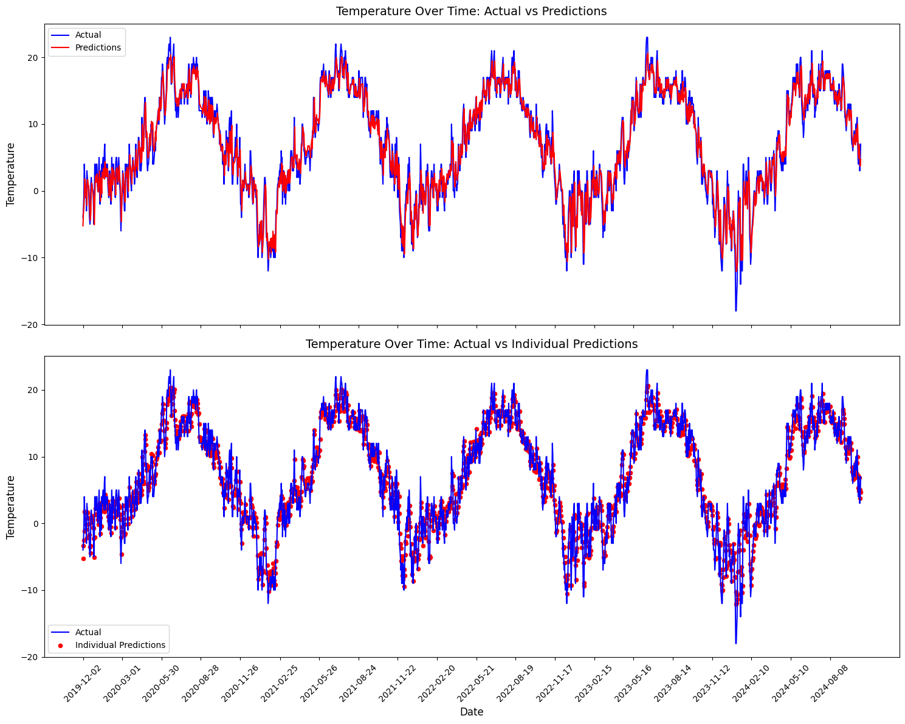
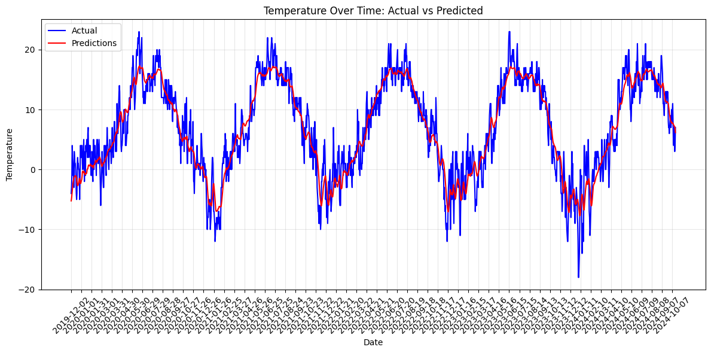
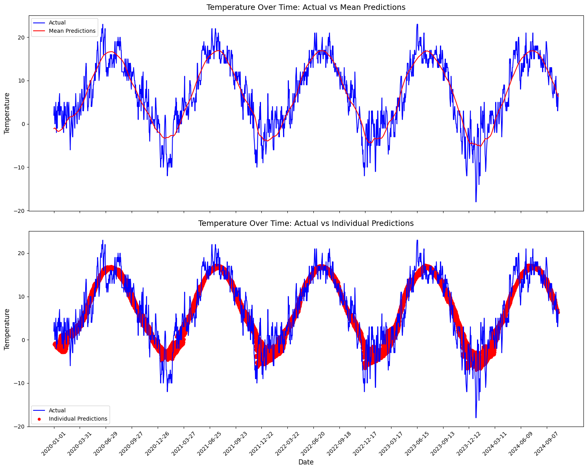
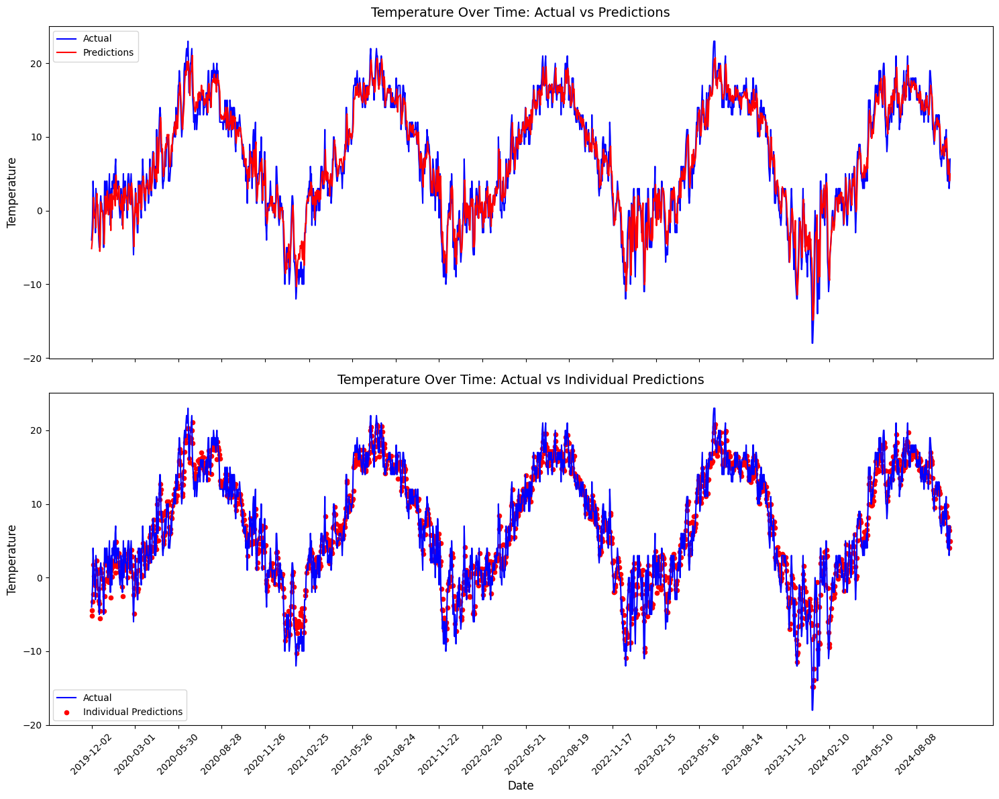
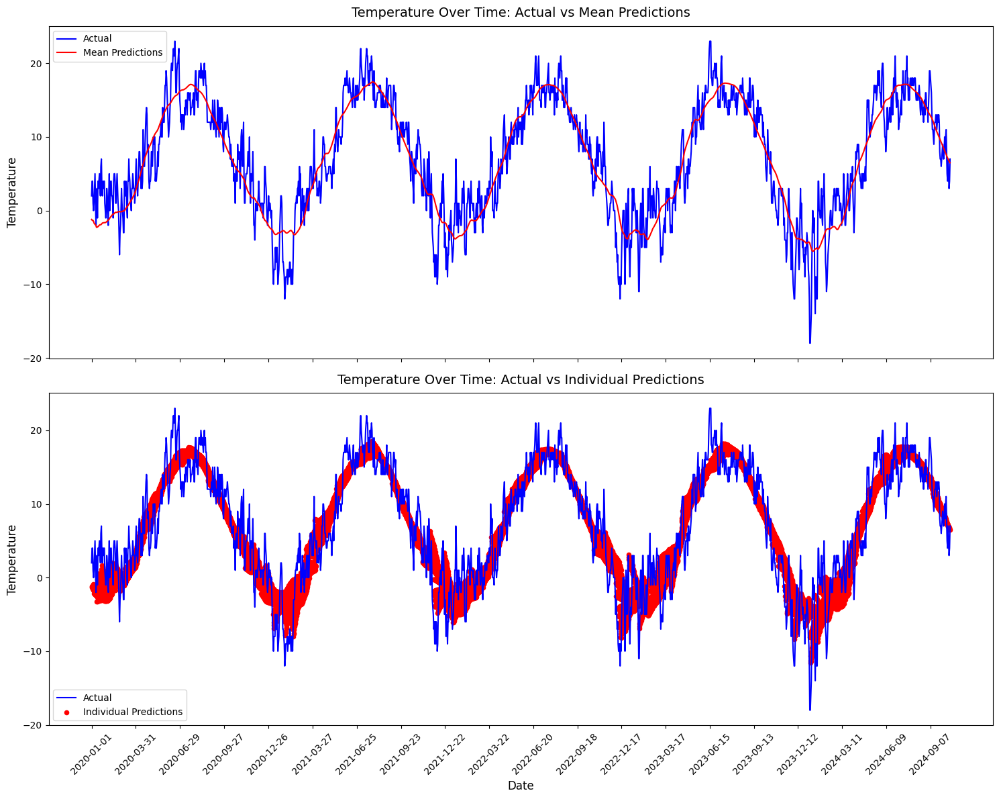
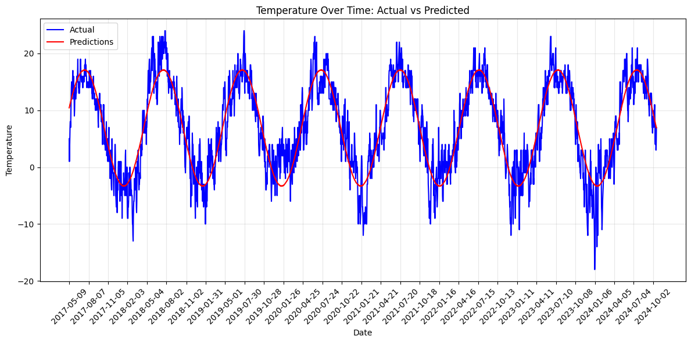

# LSTM 1 Day Model Results
Execution time: 505.88772344589233

Metrics Results:
MAE:  1.588168740272522
MSE:  4.137491703033447
RMSE:  2.0340825211955997
Accuracy:  0.40875912408759124

# LSTM 7 Day Model Results
Execution time: 438.8875186443329

Metrics Results:
MAE:  2.336643934249878
MSE:  9.057571411132812
RMSE:  3.0095799393159193
Accuracy:  0.2852313883299799

# LSTM 30 Day Model Results
Execution time: 703.8611075878143

Metrics Results:
MAE:  2.640164613723755
MSE:  11.2994384765625
RMSE:  3.3614637401826157
Accuracy:  0.24794812233836624

# CNN 1 Day Model Results
Execution time: 311.3089418411255

Metrics Results:
MAE:  1.6563787460327148
MSE:  4.518187999725342
RMSE:  2.1256029732114468
Accuracy:  0.37787759685569905

# CNN 7 Day Model Results
Execution time: 232.4338574409485

Metrics Results:
MAE:  2.4008078575134277
MSE:  9.606904029846191
RMSE:  3.0995006097508986
Accuracy:  0.273158953722334

# CNN 30 Day Model Results
Execution time: 558.7830646038055

Metrics Results:
MAE:  2.6814708709716797
MSE:  11.59561824798584
RMSE:  3.4052339490827706
Accuracy:  0.23557878435927215

# Linear Regression Model Results
Execution time: 10.61634635925293

Root Mean Squared Error (RMSE): 3.32033457629992
Mean Squared Error (MSE): 11.02462169857277
Mean Absolute Error (MAE): 2.616418599524208
Accuracy: 0.23969072164948457
